# modelagem-de-software
Projeto de Modelagem de Software do 6º Semestre (FEI)

## Diagrama de Casos de Uso:
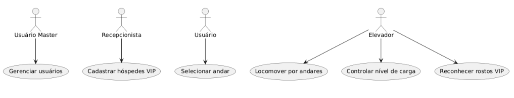

|Identificação|UC_Gerenciar|
|---|---|
|Função|Gerencia Usuários do Sistema de Controle|
|Atores| Usuário Master, Usuário|
|Prioridade|Essencial|
|Pré-condição| Usuário precisa de uma autorização|
|Pós-condição|O usuário tem nível de autorização desejado|
|Fluxo Principal|1. O usuário envia uma requisição de autorização 2. Usuário master avalia requisição (FS-001) 3. Usuário master aprova troca de nível de autorização no sistema|
|Fluxo Secundário (FS-001))|1. Usuário master não concede autorização e encerra o processo|

|Identificação|UC_Selecionar|
|---|---|
|Função|Seleciona o andar|
|Atores|Usuário, Elevador|
|Prioridade|Essencial|
|Pré-condição|O usuário deseja usar o elevador|
|Pós-condição|Elevador se locomove para o andar do usuário|
|Fluxo Principal|1. O usuário seleciona o andar desejado na botoeira externa  2. É emitido um sinal para o elevador|
|Fluxo Secundário(FS-001)|1. O elevador já está no andar onde se encontra o usuário  2. A porta do elevador se abre|

|Identificação|UC_Cadastrar|
|---|---|
|Função|Cadastrar hóspede VIP no sistema|
|Atores|Recepcionista|
|Prioridade|Essencial|
|Pré-condição|Check-in de hóspede VIP|
|Pós-condição|Hóspede VIP cadastrado com sucesso|
|Fluxo Principal|1. Recepcionista abre página de check-in de VIP. 2. Recepcionista escreve e envia informações do hóspede no sistema (FS-001) 3. Sistema retorna confirmação de cadastro|
|Fluxo Secundário (FS-001))|1. Sistema retorna erro e aponta quais campos de cadastro estão errados 2. Recepcionista corrige erros e envia novamente|

|Identificação|UC_Controlar|
|---|---|
|Função|Controlar Nível de Carga|
|Atores|Elevador|
|Prioridade|Essencial|
|Pré-condição|Elevador detecta peso acima do limite|
|Pós-condição|Elevador retorna a operação normal|
|Fluxo Principal|1. Elevador emite sinal de aviso 2. Elevador aguarda parado até que o peso carregado esteja abaixo do limite 3. Elevador encerra o sinal de aviso|

|Identificação|UC_Locomover|
|---|---|
|Função|Locomoção do Elevador|
|Atores|Elevador|
|Prioridade|Essencial|
|Pré-condição|Elevador recebe sinal de chamada de um andar diferente do atual|
|Pós-condição|Elevador abre suas portas|
|Fluxo Principal|1. Elevador fecha as portas 2. Elevador anda até andar de destino (FS-001)(FS-002)(FS-003) 3. Elevador chega ao andar de destino|
|Fluxo Secundário (FS-001)|1. Elevador detecta abnormalidade 2. Elevador para no andar mais pŕoximo 3. Elevador abre as portas|
|Fluxo Secundário (FS-002)|1. Usuário de dentro do elevador aperta o botão de emergência 2. Elevador para no andar mais pŕoximo 3. Elevador abre as portas|
|Fluxo Secundário (FS-003)|1. É detectada uma situação de incendio 2. Elevador se direciona para o térreo 3. Elevador abre as portas|

|Identificação|UC_Reconhecer|
|---|---|
|Função|Reconhecer faces de hóspedes VIP|
|Atores|Elevador|
|Prioridade|Essencial|
|Pré-condição|Câmera detecta pessoa|
|Pós-condição|Elevador leva hópede VIP até o andar selecionado|
|Fluxo Principal|1. Hópede revela face para a câmera 2. Elevador retorna confirmação e inicia locomoção até o andar desejado (FS-001)|
|Fluxo Secundário (FS-001)|1. Hóspede detectado não é VIP 2. Elevador continua com funções normais|

## Diagrama de Classes
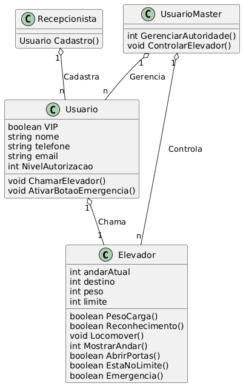

## Diagramas de Sequência
### UC_Gerenciar
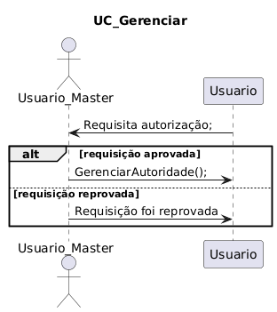
### UC_Reconhecer 

## Diagramas de Estados
### Elevador
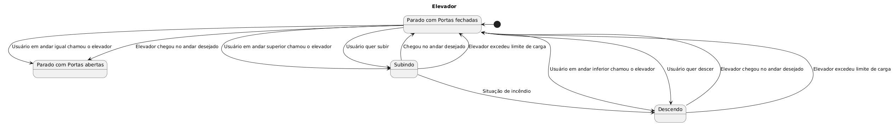
### Usuário
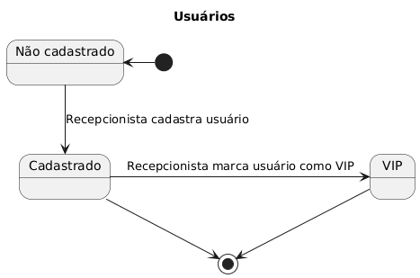

## Diagrama de Atividade
### UC_Gerenciar
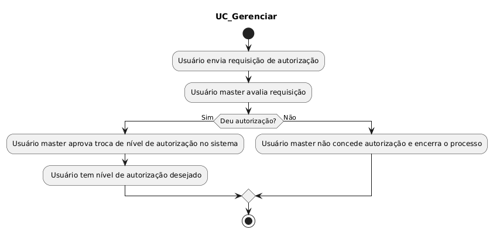
### UC_Selecionar
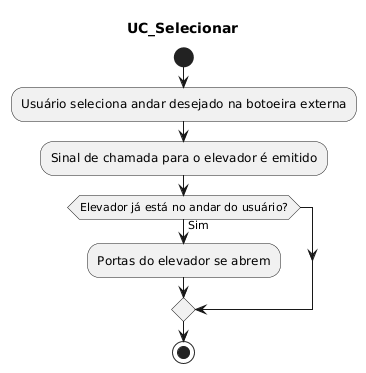
### UC_Cadastrar
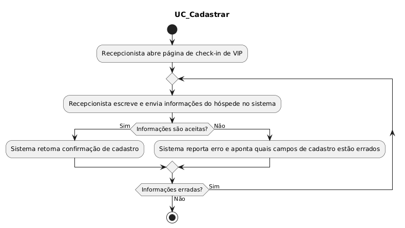
### UC_Controlar
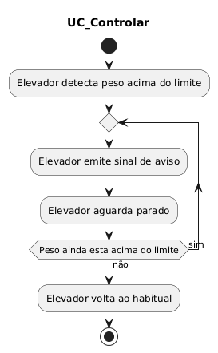
### UC_Locomover
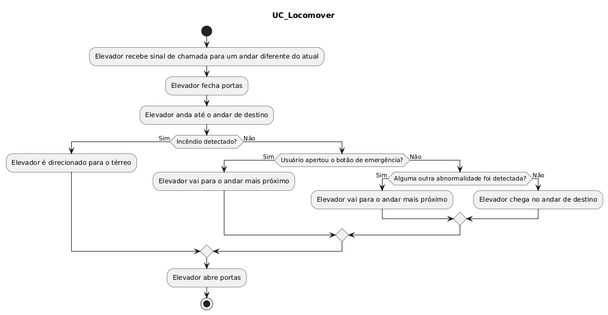
### UC_Reconhecer
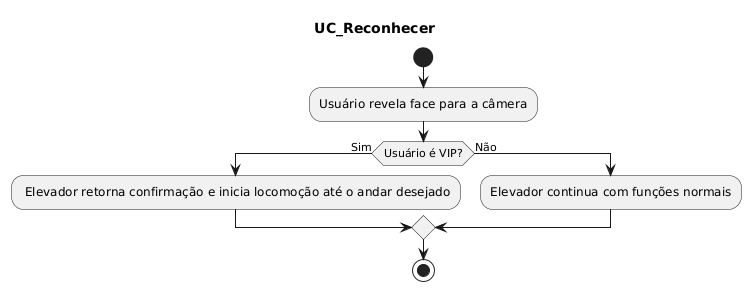

## Diagrama de Componentes

