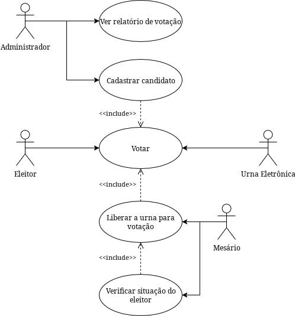

# modelagem-de-software
Projeto de Modelagem de Software do 6º Semestre (FEI)
## Diagrama de Casos de Uso

## Casos de Uso:
|Identificação|UC_votacao|
|---|---|
|Função|Eleitor vota na urna eletrônica|
|Atores|Eleitor, Urna Eletrônica|
|Prioridade|Essencial|
|Pré-condição|Liberação da Urna para Voto do Eleitor|
|Pós-condição|Voto do eleitor é computado|
|Fluxo Principal|1. Eleitor digita número desejado na urna 2. <b>a.</b> Se número for de um candidato válido, urna computa número e retorna informações do candidato 2. <b>b.</b> Se número for inválido, urna computa voto nulo 2. <b>c.</b> Em caso de voto em branco, urna computa voto em branco 3. Eleitor confirma voto 4. Urna retorna confirmação 5. Loop para seleção de candidato de outro(s) cargo(s) |

|Identificação|UC_liberacao|
|---|---|
|Função|Mesário Valida Eleitor para Votar|
|Atores|Mesário|
|Prioridade|Essencial|
|Pré-condição|Normalidade do título do eleitor|
|Pós-condição|Eleitor é liberado para votar|
|Fluxo Principal|1. Mesário reseta urna eletrônica para iniciar outra votação|

|Identificação|UC_situacao|
|---|---|
|Função|Mesário verifica a situação do eleitor|
|Atores|Mesário|
|Prioridade|Essencial|
|Pré-condição|Eleitor compareceu na eleição|
|Pós-condição|Mesário está pronto para liberar a urna eletrônica|
|Fluxo Principal|1. Mesário verifica no sistema a situação do título do eleitor (FS-001) 2. Mesário sobe ao sistema que eleitor compareceu|
|Fluxo Secundário (FS-001)|1. Situação do título do eleitor não está normal 2. Mesário informa a situação e não libera a urna|

|Identificação|UC_relatorio|
|---|---|
|Função|Administrador gera relatório de votação|
|Atores|Administrador|
|Prioridade|Essencial|
|Pré-condição|Votação ocorreu|
|Pós-condição|Relatório de votação é gerado|
|Fluxo Principal|1. Administrador requere relatório para o sistema 2. 2. Sistema gera relatório com os resultados apresentados em forma de tabelas(FS-002), separados por UEv. Também são contabilizados os votos brancos e nulos, bem como os eleitores ausentes.|
|Fluxo Secundário (FS-001)|1. Abnormalidade é detectada em algum fator da votação 2. Relatório é gerado com erros relatados|
|Fluxo Secundário (FS-002)|1. Administrador escolhe apresentar relatório em gráficos 2. Relatório é gerado com gráficos, separados por UEv. Também são contabilizados os votos brancos e nulos, bem como os eleitores ausentes.|

|Identificação|UC_cadastro|
|---|---|
|Função|Administrador cadastra candidato no sistema de votação|
|Atores|Administrador|
|Prioridade|Essencial|
|Pré-condição|Nenhuma|
|Pós-condição|Candidato cadastrado no sistema|
|Fluxo Principal|1. Administrador coloca cargo, nome, apelido, número e fotografia do candidato no sistema (FS-001) 2. Candidato é cadastrado com sucesso.|
|Fluxo Secundário (FS-001)|1. Sistema retorna situação fora do normal do candidato 2. Administrador não cadastra candidato|
